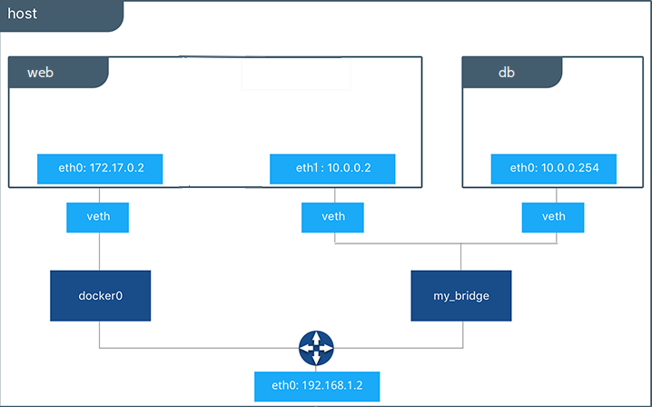

# Network container


## Launch a container on the default network

Docker includes support for networking containers through the use of **network drivers**. By default, Docker provides two network drivers for you, the `bridge`(default) and the `overlay` drivers. You can also write a network driver plugin so that you can create your own drivers but that is an advanced task.


使用 `docker network ls` 查看当前网络

```bash
$ docker network ls

NETWORK ID          NAME                DRIVER
18a2866682b8        none                null
c288470c46f6        host                host
7b369448dccb        bridge              bridge
```

The network named `bridge` is a special network, 当不指定 `--net` 的时候，默认使用该网络.
```bash
$ docker run -itd --name=networktest ubuntu

74695c9cea6d9810718fddadc01a727a5dd3ce6a69d09752239736
```


使用命令 `docker network inspect <network_name>` 查看网络信息

```bash
$ docker network inspect bridge
```

## Create your own bridge network

+ Docker Engine natively supports `both` `bridge` networks and `overlay` networks.
+ A `bridge` network is `limited to a single host` running Docker Engine.
+ An `overlay` network can `include multiple hosts` and is a more advanced topic.


### 创建一个 bridge 网络

```bash
# 创建一个网络
$ docker network create -d bridge my_bridge
bca088e559338498829496538f1e58b414cfe22be0737bf7b6d9c36bfd2954a5
```

The `-d` flag tells Docker to `use` the `bridge driver` for the new network. You could have left this flag off as bridge is the `default` value for this flag.

### 查看当前所有网络

使用命令 `docker network ls`

```bash
$ docker network ls

NETWORK ID          NAME                DRIVER
7b369448dccb        bridge              bridge
615d565d498c        my_bridge           bridge
18a2866682b8        none                null
c288470c46f6        host                host
```

### 查看网络详细信息

使用命令 `docker network inspect <network_name>`

```bash

# 查看网络信息
$ docker network inspect my_bridge
[
    {
        "Name": "my_bridge",
        "Id": "bca088e559338498829496538f1e58b414cfe22be0737bf7b6d9c36bfd2954a5",
        "Created": "2017-09-08T17:18:10.67709847+08:00",
        "Scope": "local",
        "Driver": "bridge",
        "EnableIPv6": false,
        "IPAM": {
            "Driver": "default",
            "Options": {},
            "Config": [
                {
                    "Subnet": "172.20.0.0/16",
                    "Gateway": "172.20.0.1"
                }
            ]
        },
        "Internal": false,
        "Attachable": false,
        "Ingress": false,
        "ConfigFrom": {
            "Network": ""
        },
        "ConfigOnly": false,
        "Containers": {
            "c1f13c8b73e75a3e424bb55bc98158348090a8121404541c371f3201a28ab113": {
                "Name": "alpine_test",
                "EndpointID": "61eb93407ef612356ca566d5b2e7ce2f246890e8551781e35f5246f88f7cb51b",
                "MacAddress": "02:42:ac:14:00:02",
                "IPv4Address": "172.20.0.2/16",
                "IPv6Address": ""
            }
        },
        "Options": {},
        "Labels": {}
    }
]
```

## Add containers to a network

Networks, by definition, provide `complete isolation(完全隔离)` for containers.

创建容器时，使用 `--net=<network_name>` flag 为容器指定网络
```bash
# 将一个容器加入网络
$ docker run --rm -itd --net=my_bridge --name alpine_test alpine

c1f13c8b73e75a3e424bb55bc98158348090a8121404541c371f3201a28ab113
```

### 查看容器网络信息

使用命令 `docker inspect --format='{{json .NetworkSettings.Networks}}' <container_name>`

```bash
# 通过容器查看网络信息
$ docker inspect --format='{{json .NetworkSettings.Networks}}' alpine_test
{"my_bridge":{"IPAMConfig":null,"Links":null,"Aliases":["c1f13c8b73e7"],"NetworkID":"bca088e559338498829496538f1e58b414cfe22be0737bf7b6d9c36bfd2954a5","EndpointID":"61eb93407ef612356ca566d5b2e7ce2f246890e8551781e35f5246f88f7cb51b","Gateway":"172.20.0.1","IPAddress":"172.20.0.2","IPPrefixLen":16,"IPv6Gateway":"","GlobalIPv6Address":"","GlobalIPv6PrefixLen":0,"MacAddress":"02:42:ac:14:00:02","DriverOpts":null}}
```

### 将容器移除网络

You can remove a `container` from a `network` by disconnecting the container. To do this, you supply `both` the `network name` and the `container name`. You can also use the `container ID`. In this example, though, the name is faster.

将一个 `container` 从给一个网络中移除时，使用命令 `docker network disconnect <network_name> <container_name/container_id>`

```bash

# 将容器移除网络
$ docker network disconnect my_bridge alpine_test

# 重新通过容器查看网络信息
$ docker inspect --format='{{json .NetworkSettings.Networks}}' alpine_test
{}

# 查看容器状态
# 容器虽然脱离网络，但是依然存活
$ docker container ps -a
CONTAINER ID        IMAGE               COMMAND                  CREATED             STATUS                         PORTS               NAMES
c1f13c8b73e7        alpine              "/bin/sh"                5 minutes ago       Up 5 minutes                                       alpine_test

```

## 容器的网络隔离

创建两个容器，
+ 容器 `db` 使用 `my_bridge` 网络
+ 容器 `web` 使用默认的 `bridge` 网络

```bash

# 创建容器
$ docker run -d --net=my_bridge --name db training/postgres
53365bd018e5525703ac8230717c1e5df6fa020f72e4f90b45f9d87dc6e7d725
$ docker run -itd --name web ubuntu
774887a1a4d4cd5b254f6797dadebd0388b6707f1f051435ec881251bf273320

```


进入容器 `db`，尝试 ping 容器 `web`。 以失败而告终
```bash
# 查看IP地址
$ docker inspect --format='{{range .NetworkSettings.Networks}}{{.IPAddress}}{{end}}' db
172.20.0.2
$ docker inspect --format='{{range .NetworkSettings.Networks}}{{.IPAddress}}{{end}}' web
172.17.0.2

$ docker exec -it db bash
root@53365bd018e5:/# ping 172.17.0.2
PING 172.17.0.2 (172.17.0.2) 56(84) bytes of data.
^C
--- 172.17.0.2 ping statistics ---
2 packets transmitted, 0 received, 100% packet loss, time 1007ms

```

### 将容器加入网络

使用命令 `docker network connect <network_name> <container_name>`

```bash
$ docker network connect my_bridge web

$ docker inspect --format='{{range .NetworkSettings.Networks}}{{.IPAddress}}{{end}}' web
172.17.0.2
172.20.0.3
```

重新 ping `web` 的新地址

```bash
$ docker exec -it db bash
root@53365bd018e5:/# ping 172.20.0.3
PING 172.20.0.3 (172.20.0.3) 56(84) bytes of data.
64 bytes from 172.20.0.3: icmp_seq=1 ttl=64 time=0.129 ms
64 bytes from 172.20.0.3: icmp_seq=2 ttl=64 time=0.087 ms
64 bytes from 172.20.0.3: icmp_seq=3 ttl=64 time=0.076 ms
^C
--- 172.20.0.3 ping statistics ---
3 packets transmitted, 3 received, 0% packet loss, time 1999ms
rtt min/avg/max/mdev = 0.076/0.097/0.129/0.024 ms
```




## 删除网路

使用命令 `docker network rm <network_name>`

```bash
$ docker network rm my_bridge
my_bridge

$ docker network ls
NETWORK ID          NAME                           DRIVER              SCOPE
b2807e40afc6        bridge                         bridge              local
1f069296a405        docker_gwbridge                bridge              local
dfea931891b4        dockerregistrymirror_default   bridge              local
3c2b536039ac        host                           host                local
ffa7c88de9e4        none                           null                local
```
